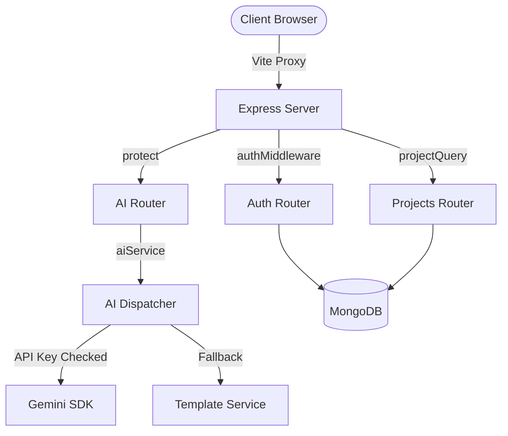

# ProjectPilot 🚀

An AI-Powered Project Recommendation & Planning Platform that helps students and developers discover project ideas, generate comprehensive technical synopses, extract ready-to-paste developer prompts, and map execution timelines.

Built using the **MERN** stack (MongoDB, Express, React, Node.js) with **Vite**, **Tailwind CSS**, and **React Query**, designed to look and feel like a premium, funded AI SaaS application.

---

## Key Features

- **Personalized Recommendations**: Discovers projects matching your exact skill set and interest areas, with custom-calculated **Feasibility Scores**.
- **Swappable AI Service Layer**: Abstracted backend integration that interfaces with **Google Gemini API** (using `gemini-1.5-flash`) when keys are present, and falls back to structured template interpolation otherwise.
- **AI Synopsis Generator**: Produces complete project proposals containing abstract, problem statements, detailed objectives, deliverables, and limits.
- **AI Prompt Generator**: Creates ready-to-paste instruction prompts specifically optimized for Claude, ChatGPT, or Cursor workflows.
- **Visual Timelines**: Maps project milestones and estimated durations in a timeline roadmap.
- **Bookmarks & Comparison Matrix**: Pin candidate projects and compare up to three projects side-by-side.

---

## Tech Stack

| Layer | Choice |
|---|---|
| **Frontend** | React (Vite), Tailwind CSS v3, React Router DOM v6, Axios, React Query (TanStack Query v5), Lucide Icons |
| **Backend** | Node.js, Express.js (ES Modules) |
| **Database** | MongoDB + Mongoose |
| **Auth** | JWT (15m Access Token + 7d Database-verified Refresh Token rotation), bcryptjs |
| **Validation** | Zod Schema Validation |
| **Testing** | Vitest, Supertest |

---

## Setup & Running Locally

### Prerequisites
- Node.js (v18+)
- MongoDB running locally (default: `mongodb://127.0.0.1:27017/projectpilot`)

### Installation

1. Clone the repository and navigate to the project directory:
   ```bash
   cd ProjectPilot
   ```

2. Install root and package workspace dependencies:
   ```bash
   npm install
   npm run install:all
   ```

3. Configure Environment Variables:
   Create a `.env` file in the `backend/` directory matching the variables in `backend/.env.example`:
   ```env
   PORT=5000
   MONGODB_URI=mongodb://127.0.0.1:27017/projectpilot
   JWT_SECRET=your_jwt_access_secret_here
   JWT_REFRESH_SECRET=your_jwt_refresh_secret_here
   NODE_ENV=development
   GEMINI_API_KEY=your_gemini_api_key_here  # Optional: falls back to template seeder if omitted
   ```

4. Seed the Database:
   Populate initial project templates:
   ```bash
   node backend/scripts/seed.js
   ```

5. Run Development Servers:
   Launch backend (port 5000) and frontend (port 5173) concurrently:
   ```bash
   npm run dev
   ```

---

## Testing

Run the Vitest integration suite on the backend to test authentication, registration validation, and secure session route-guards:
```bash
npm run test --prefix backend
```

---

## Architecture Design


